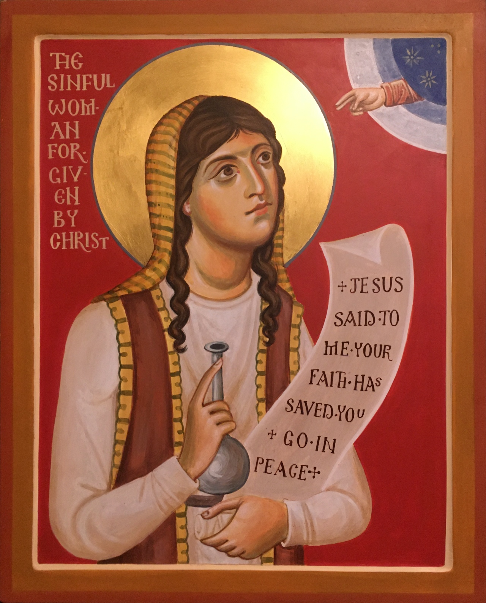

From the hand of <a
href="https://aidanharticons.com/">Aidan Hart</a>.

### In the Gospels

#### Luke 7:36-50

One of the Pharisees invited him to eat with him. He entered into the
Pharisee’s house, and sat at the table. Behold, a woman in the city who was a
sinner, when she knew that he was reclining in the Pharisee’s house, she
brought an alabaster jar of ointment. <u class="blue">Standing behind at his
feet weeping, she began to wet his feet with her tears, and she wiped them with
the hair of her head, kissed his feet, and anointed them with the ointment.</u>
Now when the Pharisee who had invited him saw it, he said to himself, This man,
if he were a prophet, would have perceived who and what kind of woman this is
who touches him, that she is a sinner.

Jesus answered him, Simon, I have something to tell you. He said, Teacher, say
on.

A certain lender had two debtors. The one owed five hundred denarii, and the
other fifty. When they couldn’t pay, he forgave them both. Which of them
therefore will love him most?

Simon answered, He, I suppose, to whom he forgave the most.

He said to him, You have judged correctly. Turning to the woman, he said to
Simon, <u>Do you see this woman? I entered into your house, and you gave me no
water for my feet, but she has wet my feet with her tears, and wiped them with
the hair of her head. You gave me no kiss, but she, since the time I came in,
has not ceased to kiss my feet. You didn’t anoint my head with oil, but she has
anointed my feet with ointment. Therefore I tell you, her sins, which are many,
are forgiven, for she loved much. But to whom little is forgiven, the same
loves little.</u> He said to her, <u>Your sins are forgiven.</u>

Those who sat at the table with him began to say to themselves, Who is this who
even forgives sins?

He said to the woman, <u>Your faith has saved you. Go in peace.</u>
